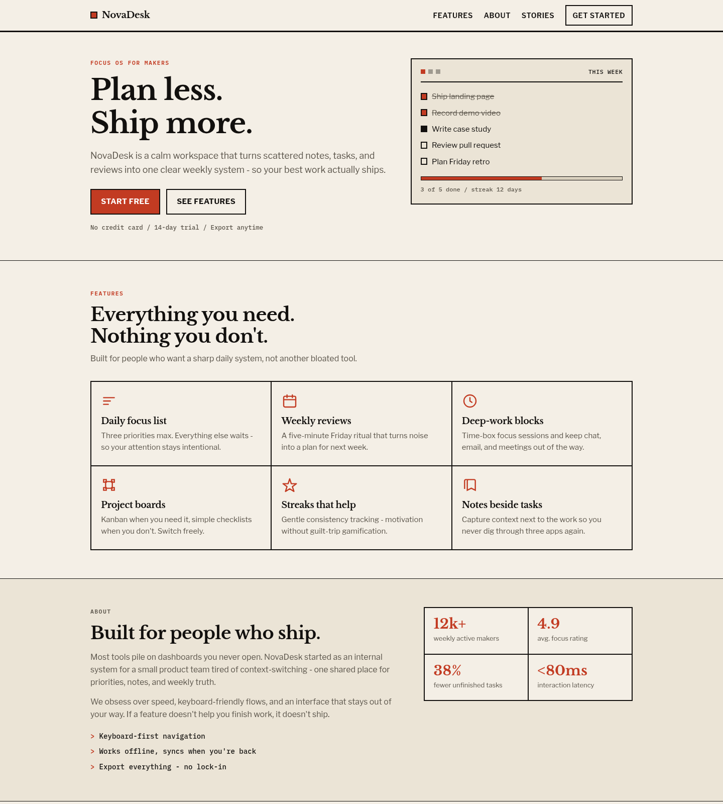
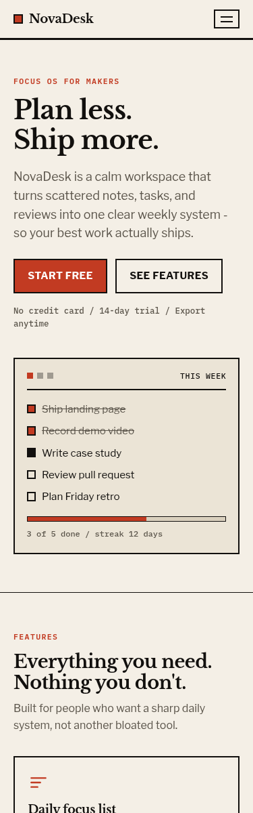

# Landing Page - NovaDesk

**OIBSIP / Web Development & Designing / Level 1 / Task 1**

Static marketing landing page for a fictional productivity product (**NovaDesk**).
Built with **HTML5 + CSS3** (tiny optional JS for the mobile menu only).

## Feature checklist

- [x] Fixed navigation bar with ≥3 links (Features, About, Stories, Get started)
- [x] Hero: headline, subheadline, primary CTA (+ secondary)
- [x] Content sections: Features (6 cards), About + stats, Testimonials (3)
- [x] Footer with contact + social placeholder links
- [x] Consistent palette across all sections (ink navy, warm cream, coral)
- [x] Responsive via CSS Grid + Flexbox - verified at 1440 / 768 / 375 / 320
- [x] No overlap; explicit `box-sizing`, spacing scale, safe paddings
- [x] Typography: Libre Baskerville (display) vs Libre Franklin (body), IBM Plex Mono labels

## Sections

1. Fixed header + slide-down mobile menu  
2. Hero + product UI mock panel  
3. Features grid (6)  
4. About + statistics  
5. Testimonials (3)  
6. CTA band  
7. Footer (product / company / social)

## Run locally

```bash
cd WebDev-L1-LandingPage
python3 -m http.server 8080
# open http://localhost:8080
```

Or open `index.html` directly in a browser.

## Design direction

Editorial newspaper: cream paper, black rules, signal red, sharp cards


## Screenshots





## Author

Bilal Malik / [GitHub](https://github.com/bilalmlkdev) / [LinkedIn](https://linkedin.com/in/bilalmlkdev)

Part of [OIBSIP](https://github.com/bilalmlkdev/OIBSIP) / `#oasisinfobyte`
