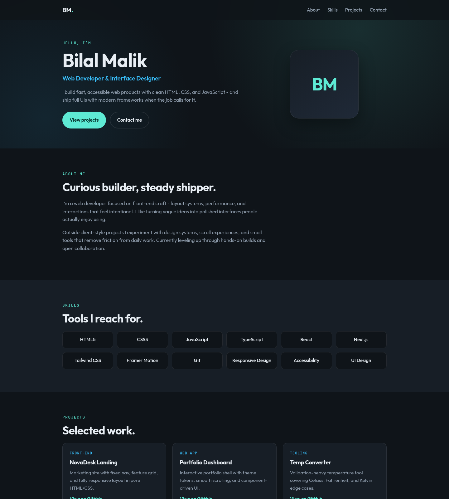
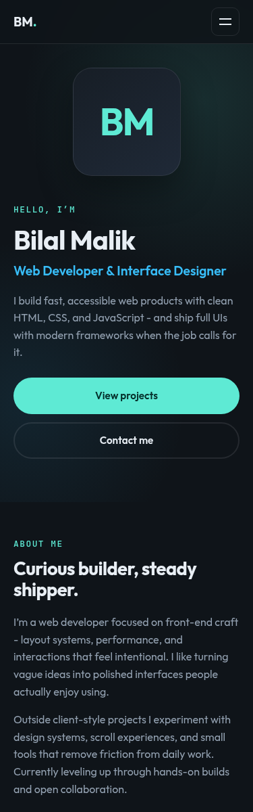

# Personal Portfolio - Bilal Malik

**OIBSIP · Web Development & Designing · Level 1 · Task 2**

Personal portfolio website (digital résumé) built with **HTML5 + CSS3**
(JavaScript only for the mobile menu).

## Feature checklist

- [x] Profile/hero: name, role title, avatar placeholder (BM monogram)
- [x] About Me: 2-3 sentences on background & interests
- [x] Skills: visual grid of technical skills (12 items)
- [x] Projects: 3 cards (title, description, GitHub link)
- [x] Contact: name, email fields + LinkedIn / GitHub links
- [x] Smooth scroll navigation between sections (`scroll-behavior: smooth`)
- [x] Consistent branding: dark teal palette, Outfit + JetBrains Mono
- [x] Fully responsive - desktop and mobile (nav collapses ≤640px)

## Sections

1. Fixed nav (About · Skills · Projects · Contact)  
2. Hero + avatar  
3. About  
4. Skills grid  
5. Projects (3)  
6. Contact form + social links  
7. Footer  

## Run locally

```bash
cd WebDev-L1-PersonalPortfolio
python3 -m http.server 8080
# open http://localhost:8080
```

## Design tokens

| Token | Value |
|-------|-------|
| Background | `#0f1419` |
| Surface | `#171e26` |
| Accent | `#5eead4` |
| Accent 2 | `#38bdf8` |
| Fonts | Outfit · JetBrains Mono |

## Screenshots





## Author

Bilal Malik · [GitHub](https://github.com/bilalmlkdev) · [LinkedIn](https://linkedin.com/in/bilalmlkdev)

Part of [OIBSIP](https://github.com/bilalmlkdev/OIBSIP) · `#oasisinfobyte`
