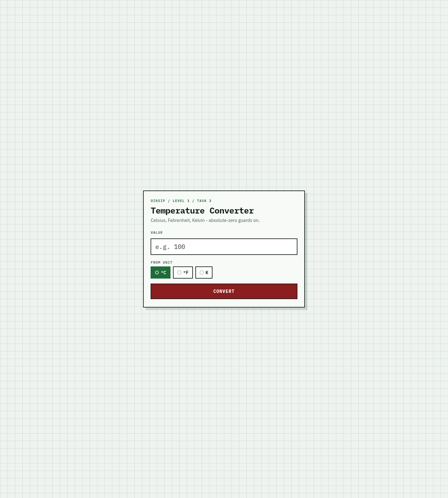

# Temperature Converter

**OIBSIP / Web Development & Designing / Level 1 / Task 3**

Interactive converter for **Celsius / Fahrenheit / Kelvin** with input validation
and absolute-zero edge handling. Vanilla HTML + CSS + JavaScript.

## Feature checklist

- [x] Numeric input with validation - rejects non-numeric / empty with error message
- [x] Unit selector: radio group for input unit (°C / °F / K)
- [x] Auto-conversion showing **all three** output units at once
- [x] Convert button triggers calculation on submit/click
- [x] Results show values with correct unit labels
- [x] Edge case: friendly error for absolute-zero violations
  - C &lt; -273.15 → blocked  
  - F &lt; -459.67 → blocked  
  - K &lt; 0 → blocked  
  - At absolute zero → special success note
- [x] Clean centred UI with clear labels

## Formulas

| From | To | Formula |
|------|----|---------|
| C → F | `(C × 9/5) + 32` |
| F → C | `(F - 32) × 5/9` |
| C → K | `C + 273.15` |
| K → C | `K - 273.15` |

## Run locally

```bash
cd WebDev-L1-TemperatureConverter
python3 -m http.server 8080
# open http://localhost:8080
```

## Try these

| Input | Unit | Expect |
|------:|------|--------|
| `100` | °C | 212 °F / 373.15 K |
| `-40` | °C or °F | -40 both scales |
| `-300` | °C | Error (below absolute zero) |
| `abc` | any | Error (non-numeric) |

## Design direction

Lab worksheet: graph paper, mono readouts, stamp button

## Demo video

[Watch on YouTube](https://youtu.be/4XVEwesE0Po)

<https://youtu.be/4XVEwesE0Po>

## Screenshots




## Author

Bilal Malik / [GitHub](https://github.com/bilalmlkdev) / [LinkedIn](https://linkedin.com/in/bilalmlkdev)

Part of [OIBSIP](https://github.com/bilalmlkdev/OIBSIP) / `#oasisinfobyte`
