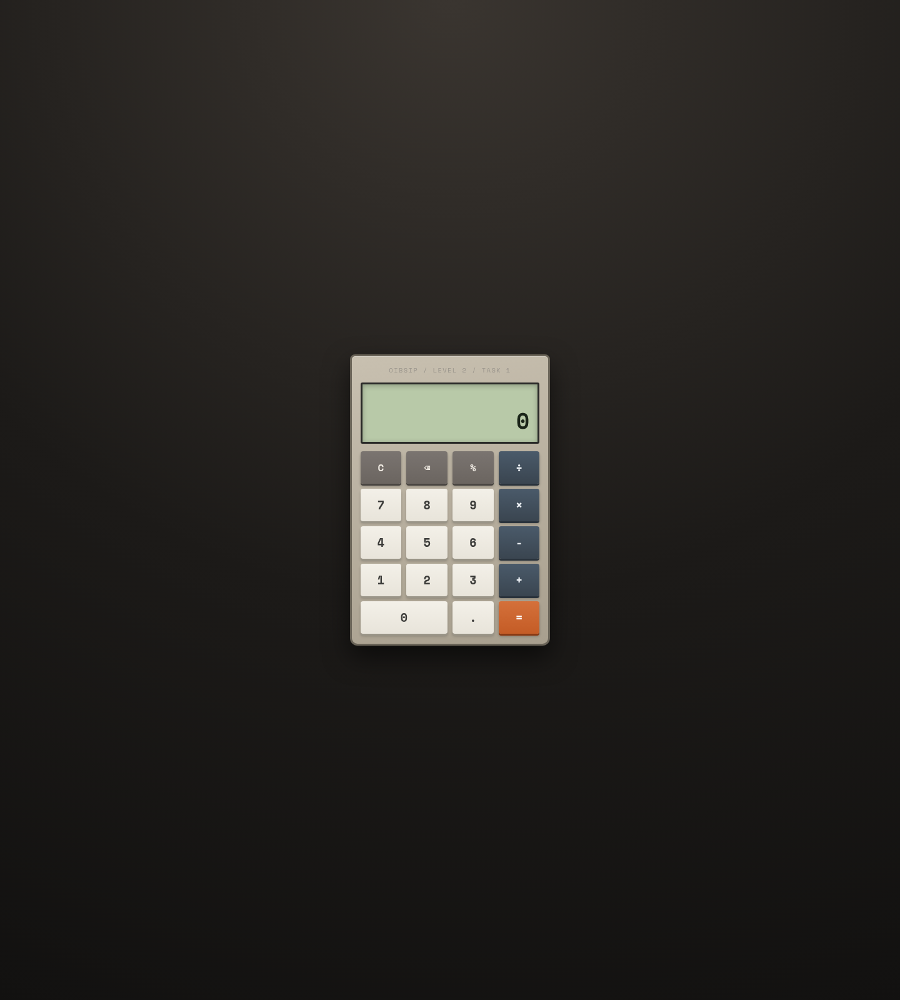

# Calculator

**OIBSIP / Web Development & Designing / Level 2 / Task 1**

Browser calculator with a clean button grid. **Vanilla JS - no `eval()`**;
expression evaluation uses explicit operand/operator state.

## Feature checklist

- [x] Display: current input + expression line + result
- [x] Digits 0-9 + decimal point
- [x] Operators: `+` `-` `×` `÷`
- [x] Equals `=` evaluates the expression
- [x] Clear `C` resets the display
- [x] Backspace `⌫` removes last character
- [x] Division by zero → `"Cannot divide by zero"` (no crash)
- [x] Operator chaining: `5 + 3 × 2` works left-to-right without full reset
  (standard calculator chaining - each operator applies the pending op first)
- [x] **CSS Grid** for button layout (`grid-template-columns: repeat(4, 1fr)`)
- [x] All events via `addEventListener` - **no inline `onclick`**

## Extras

- Keyboard input: digits, `+ - * /`, Enter `=`, Backspace, Esc `C`, `%`
- Percent helper
- Repeated `=` repeats last operation
- Responsive down to ~320px

## Run locally

```bash
cd WebDev-L2-Calculator
python3 -m http.server 8080
# open http://localhost:8080
```

## Test cases

| Sequence | Expected |
|----------|----------|
| `5 + 3 =` | `8` |
| `5 + 3 × 2 =` | `16` (chaining: 8 × 2) |
| `10 ÷ 0 =` | Cannot divide by zero |
| `10 ÷ 0` then `C` | resets to 0 |
| `9 ⌫` | `0` |
| `0.5 + 0.25 =` | `0.75` |

## Design direction

Physical calculator: beige plastic, green LCD, hard key shadows

## Demo video

[Watch on YouTube](https://youtu.be/FcxhAw40Yes)

<https://youtu.be/FcxhAw40Yes>

## Screenshots




## Author

Bilal Malik / [GitHub](https://github.com/bilalmlkdev) / [LinkedIn](https://linkedin.com/in/bilalmlkdev)

Part of [OIBSIP](https://github.com/bilalmlkdev/OIBSIP) / `#oasisinfobyte`
