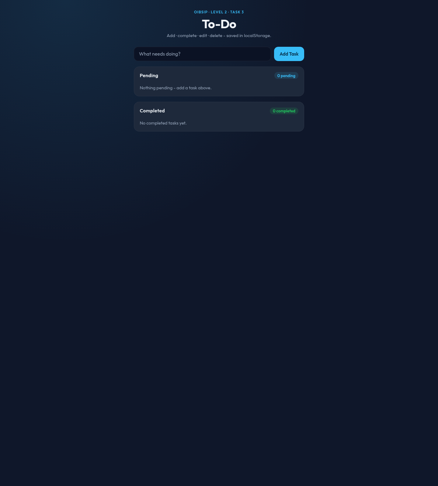
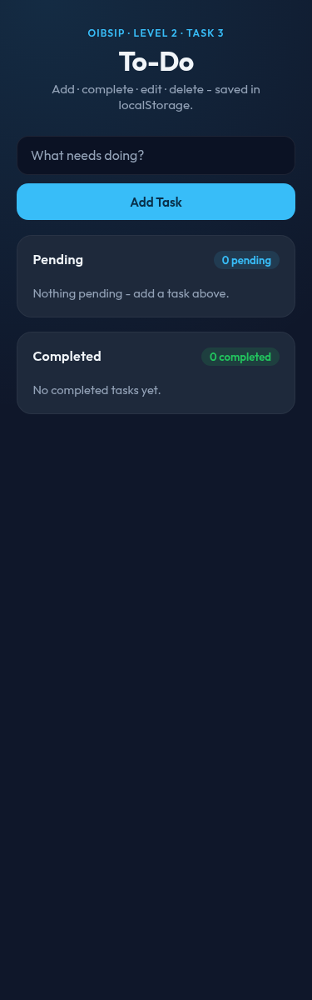

# To-Do App

**OIBSIP / Web Development & Designing / Level 2 / Task 3**

Task list with localStorage persistence - vanilla JS, no frameworks, no build step.

## Feature checklist

- [x] Add task via form (`Add Task` button + Enter)
- [x] Complete / uncomplete with checkbox (moves Pending ⇄ Completed)
- [x] Edit task inline (Save / Cancel, Enter saves, Esc cancels)
- [x] Delete task
- [x] **Counts:** `"N pending"` and `"N completed"`
- [x] **Empty states** for both lists
- [x] **localStorage** - survives refresh (`oibsip-todo-v1`)
- [x] Validation: empty task rejected with visible error
- [x] All events via `addEventListener` (event delegation on lists) - no inline `onclick`
- [x] Responsive layout

## Run locally

```bash
cd WebDev-L2-TodoApp
python3 -m http.server 8080
# open http://localhost:8080
```

## Test cases

| Action | Expected |
|--------|----------|
| Add "Buy milk" | appears under Pending, `1 pending` |
| Refresh page | still there |
| Check it | moves to Completed, `1 completed` |
| Edit → empty → Save | error shown, text unchanged |
| Delete | removed, counts update |
| Clear all tasks | empty-state messages show |

## Design direction

Notebook page: blue rules, red margin, handwriting font

## Demo video

[Watch on YouTube](https://youtu.be/Zo4X99HHM0k)

<https://youtu.be/Zo4X99HHM0k>

## Screenshots





## Author

Bilal Malik / [GitHub](https://github.com/bilalmlkdev) / [LinkedIn](https://linkedin.com/in/bilalmlkdev)

Part of [OIBSIP](https://github.com/bilalmlkdev/OIBSIP) / `#oasisinfobyte`
