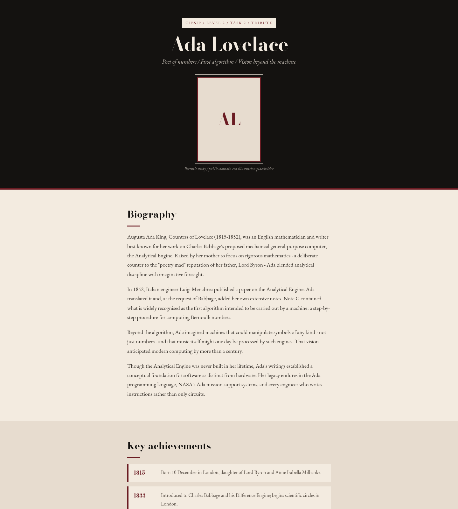
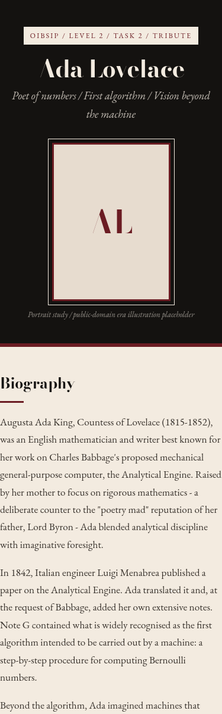

# Tribute Page - Ada Lovelace

**OIBSIP · Web Development & Designing · Level 2 · Task 2**

Visually engaging tribute to **Ada Lovelace** - mathematician and author of the
first published algorithm for a general-purpose machine.

## Feature checklist

- [x] Page title with subject name + one-line tagline
- [x] Prominent portrait frame (monogram placeholder - swap for a royalty-free
      image from Unsplash / Wikimedia Commons if you prefer a photo)
- [x] Biography: **4 original paragraphs** (paraphrased from public sources)
- [x] Timeline of **6** key achievements (styled cards)
- [x] Distinct quote block (1843 Analytical Engine line)
- [x] **2 background colours:** deep violet (`#1a1630`) hero/quote · warm cream
      (`#f6efe4`) body sections
- [x] **2 font styles:** Playfair Display (display) · Source Sans 3 (body)
- [x] Responsive - single column on small screens

## Sections

1. Hero (name, tagline, portrait)  
2. Biography  
3. Key achievements timeline  
4. Quote  
5. Footer (sources)

## Run locally

```bash
cd WebDev-L2-TributePage
python3 -m http.server 8080
# open http://localhost:8080
```

## Optional image

Replace the monogram `.portrait__frame` with:

```html

```

Use a public-domain source (e.g. Wikimedia Commons *Ada Lovelace portrait*).

## Design direction

Archive letterpress: cream stock, oxblood rules, black band

## Screenshots





## Author

Bilal Malik · [GitHub](https://github.com/bilalmlkdev) · [LinkedIn](https://linkedin.com/in/bilalmlkdev)

Part of [OIBSIP](https://github.com/bilalmlkdev/OIBSIP) · `#oasisinfobyte`
